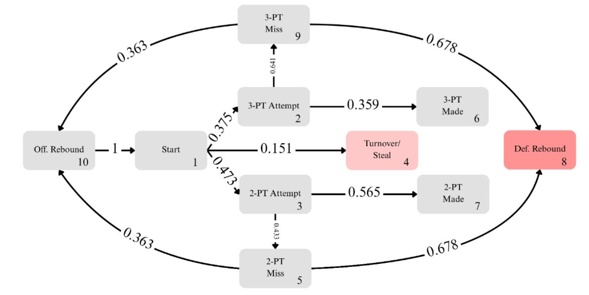

# 🏀 Modeling Intentional Fouling Strategies in NCAA Basketball Using Markov Chains

_Analyzing when trailing teams should start fouling in late-game situations._

---

## 📖 Overview
This project uses **Markov chains** to model late-game decision-making in **NCAA Division I Men's Basketball**, specifically focusing on **intentional fouling strategies**. The goal is to quantify when fouling becomes optimal compared to not fouling.

Using **play-by-play data** from the 2024–25 season, the model simulates game outcomes under different fouling start times and score differentials, helping teams make data-driven decisions in endgame scenarios.

---

## 🧠 Methodology
1. **State Definition:**  
   Each state in the Markov chain represents a specific event in a basketball possession:  (2-PT Shot Attempt, 2-PT Shot Make, Offensive Rebound, etc.)
   

3. **Data Collection:**  
   Play-by-play data was gathered using the `cbbpy` library and scraped to identify possessions and accumulate statistics.

4. **Transition Probabilities:**  
   Probabilities of moving between states were estimated using historical outcomes — accounting for free throw accuracy, turnover rates, scoring probabilities, and more.

5. **Expected Points:**  
   The chains run multiple simulations to calculate the expected points in each situation (No Foul, Foul in the Bonus, Foul in the Double Bonus) for all D1 Teams.

6. **Time Frames:**  
   Play-by-play data was scraped from different time intervals (Full Game, Last Hald, Last 5 Min, etc.) to show how the expected points changed over time.
---

## 📊 Key Findings
- Markov Chains are an effective method of finding optimal fouling times by calculating expected points  
- The optimal fouling time varied based on the offensive team (between last 5 and 1 minute for Florida, never for Alabama, etc.)  
- Team shooting percentages could replace team shooting percentages to calculate more accurate expected points and identify optimal fouling targets

---

## ⚙️ Technologies Used
- **Python** — data collection and analysis  
- **Pandas** — cleaning and processing  
- **Google Spreadsheets** — Markov chain simulation  
- **cbbpy** — college basketball play-by-play data extraction  

---
